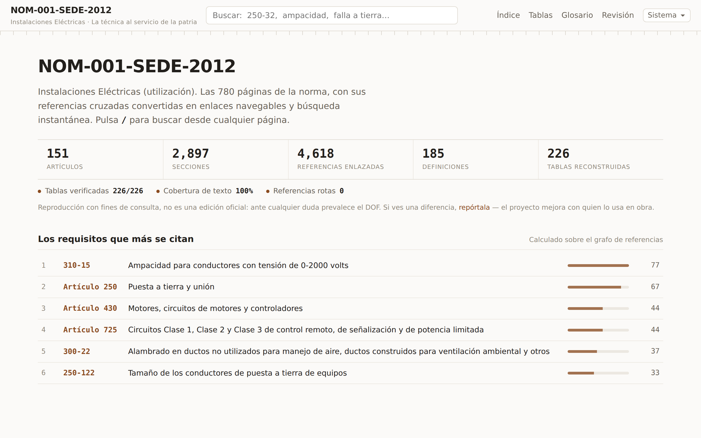

[](https://dflores296.github.io/NOM-001-SEDE-2012)

[](https://github.com/dflores296/NOM-001-SEDE-2012/actions/workflows/deploy.yml)


# NOM-001-SEDE-2012 — guía interactiva

Las 780 páginas de la **NOM-001-SEDE-2012, Instalaciones Eléctricas (utilización)**
como base de datos consultable: un artículo por página, referencias cruzadas
navegables, backlinks y búsqueda instantánea que funciona sin conexión.

**[Abrir la guía →](https://dflores296.github.io/NOM-001-SEDE-2012)**

> **No es una edición oficial.** Es una reproducción del texto publicado en el
> DOF el 29 de noviembre de 2012 con fines de consulta. Ante cualquier
> discrepancia prevalece el texto del Diario Oficial de la Federación, y nada
> aquí sustituye el criterio de una Unidad de Verificación.

## Contenido

- **151 artículos**, uno por página, con URL estable.
- **4 618 referencias cruzadas** enlazadas, y en cada artículo quién lo cita a él.
- **226 tablas** fieles al PDF, como datos consultables.
- **185 definiciones** del Artículo 100, enlazadas donde se usan.
- **51 figuras** con su número y su leyenda, más **13 fórmulas** que la norma
  publica como imagen.
- **Búsqueda instantánea** sobre el texto completo, sin conexión.

## Cifras

<!-- CIFRAS:INICIO -->
<!-- Generado por tools/build_cifras.py desde data/validacion.json y
     data/grafo.json. No editar a mano: se regenera. -->

| | |
|---|---|
| Artículos | 151 |
| Secciones | 2 897 |
| Incisos | 8 315 |
| Notas / Excepciones | 777 / 987 |
| Definiciones | 185 |
| Figuras / Fórmulas | 45 / 13 |
| Tablas | 226 |
| Referencias enlazadas | 4 618 |
| Referencias rotas | 0 |
| Cobertura del texto | 31 856 de 31 857 renglones (100 %) |
<!-- CIFRAS:FIN -->

## El identificador canónico

Todo se articula alrededor del identificador con el que la norma se cita a sí
misma:

```
250-32(a)(1)
└┬┘ └┬┘└─┬──┘
 │   │   └── incisos anidados
 │   └────── sección
 └────────── artículo
```

Ese id es a la vez la URL (`/art/250#250-32`), el ancla del enlace profundo, la
clave del grafo de referencias y la unidad de búsqueda.

## Las figuras no traen su nombre en el PDF

De las 59 imágenes de la norma, **45 llevan el rótulo dibujado dentro del propio
mapa de bits**: «Figura 230-1.- Acometidas» es parte del PNG, no texto que se
pueda extraer. Por eso las leyendas están capturadas a mano en
`data/figuras.json`, con la misma política que las tablas: la captura manda, va
sellada con la huella de la imagen que describe y el build falla si dejan de
corresponderse.

Eso es lo que permite que cada figura tenga número, ancla propia, entrada en el
[índice de figuras](https://dflores296.github.io/NOM-001-SEDE-2012/figuras/) y
lugar en la búsqueda, y que una cita como «Figura 551-46(c)» lleve a la figura y
no a la sección homónima —que en ese caso ni siquiera es donde está impresa—.

Una imagen puede traer **más de una figura**: la 516-3(c)(1) y la 516-3(c)(2)
comparten dibujo, igual que la 517-30(a) y la (b), y las dos del 923-10. Son 51
números de figura repartidos en 45 imágenes.

Quince imágenes encierran texto que en el PDF no existe como texto —una
Excepción entera en 922-12(a)(2), el inciso d) de 310-60(c)(4), la Tabla
240-92(b) completa—. Va transcrito junto a cada una, para poder buscarlo,
copiarlo y leerlo con un lector de pantalla.

## Estructura

| Ruta | Contenido |
|---|---|
| `NOM-001-SEDE-2012.pdf` | PDF fuente, 780 páginas |
| `INDICE.txt` | Índice maestro legible |
| `data/` | Corpus, definiciones, grafo, tablas, figuras, índice y métricas |
| `tools/` | Los scripts que generan `data/` desde el PDF |
| `site/` | Sitio estático (Astro) |

Cómo se reconstruye todo desde el PDF, en
[docs/arquitectura.md](docs/arquitectura.md).

## Erratas del PDF de origen

Cuatro tablas traen valores mal impresos **en el DOF**. Se reproducen tal como
los publica: corregirlos sería editar la norma, no transcribirla.

| Tabla | Dónde | El DOF imprime | Debería decir |
|---|---|---|---|
| **430-250** ⚠ | 10 hp, columna de 575 V | `44` A | `11` A |
| **505-9(d)(1)** | Temperatura superficial máxima, clases T1–T6 | `≤4` `≤3` `≤2` `≤1` `≤1` `≤85` | 450, 300, 200, 135, 100 y 85 °C |
| **922-12(a)(2)** | Flecha 2.5 m, filas de 6 600 y 23 000 V | `96` y `105` | `960` y `1 050` mm |
| **220-42** | «Hoteles y moteles», último tramo | `A partir de 1 00000` | `A partir de 100 000` |

Aparte de las erratas, la norma imprime la **Tabla 240-92(b)** como imagen y no
como rejilla, así que no está entre las 226 reconstruidas: su contenido va
transcrito debajo de la figura.

⚠ La **430-250** es la de mayor consecuencia: quien calcule un motor de 10 hp en
575 V con ese valor saldrá con un conductor y una protección cuatro veces más
grandes de lo que toca. El sustento de cada caso está en
[REVISION-TABLAS.md](REVISION-TABLAS.md).

## Documentación

- [docs/arquitectura.md](docs/arquitectura.md) — el pipeline y qué hace cada script
- [docs/reconstruccion-tablas.md](docs/reconstruccion-tablas.md) — cómo se
  obtuvieron las tablas del PDF
- [docs/notas-parser.md](docs/notas-parser.md) — las irregularidades del
  documento, para quien vuelva a procesarlo
- [REVISION-TABLAS.md](REVISION-TABLAS.md) — registro de la revisión de tablas

## Licencia

- **Texto de la norma**: los textos reglamentarios no son objeto de protección
  por derecho de autor conforme al artículo 14 de la Ley Federal del Derecho de
  Autor. Se reproduce fiel al texto oficial y no confiere derecho sobre la
  edición.
- **Código** (`tools/`, `site/`): MIT.
- **Estructura y anotaciones derivadas** (`data/`): CC BY-SA 4.0.

Las normas referenciadas por la NOM (NMX, ANCE, IEC, NFPA 70) sí tienen derechos
de autor y aquí solo se citan, nunca se reproducen.
