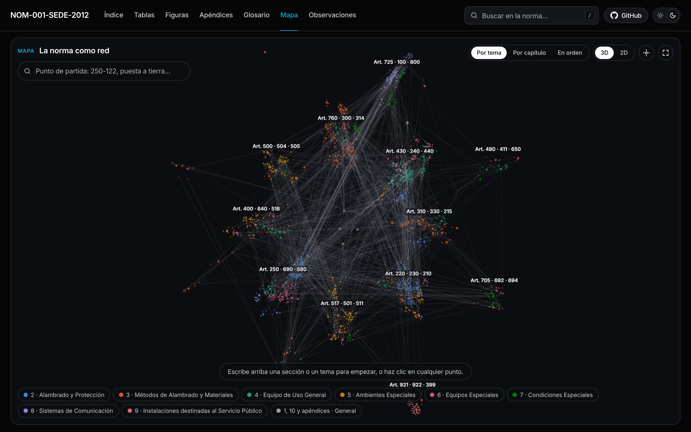
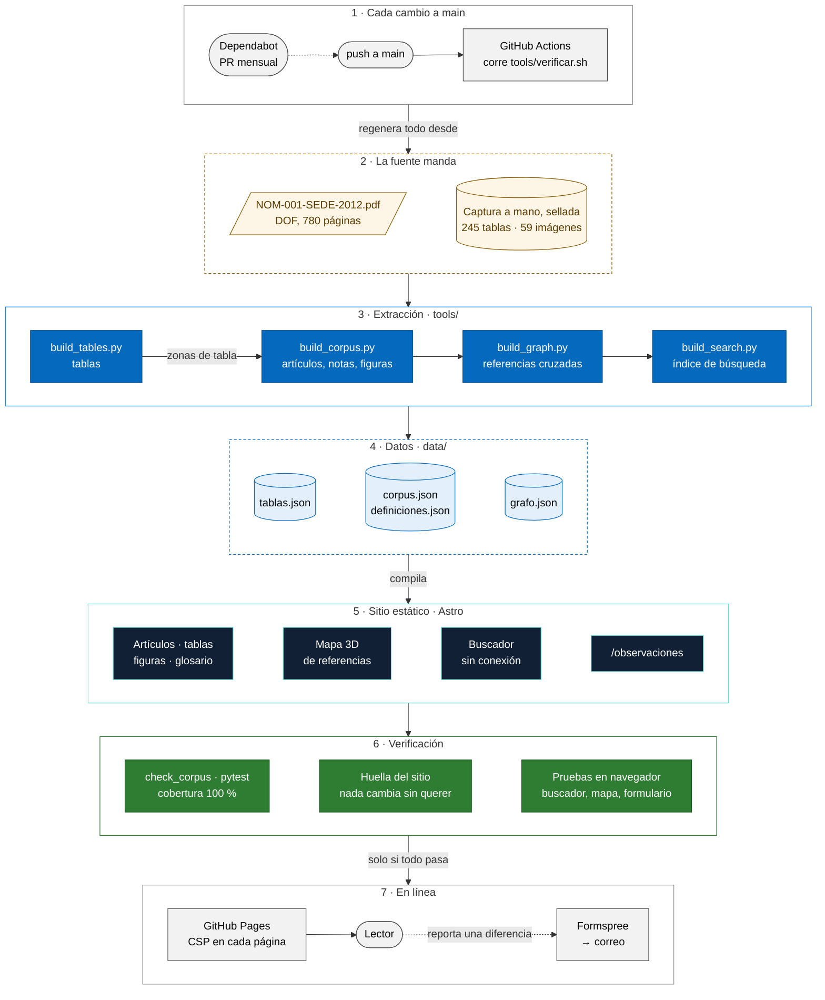

[](https://dflores296.github.io/NOM-001-SEDE-2012/mapa/)

[](https://github.com/dflores296/NOM-001-SEDE-2012/actions/workflows/deploy.yml)


# NOM-001-SEDE-2012 — guía interactiva

Las 780 páginas de la **NOM-001-SEDE-2012, Instalaciones Eléctricas (utilización)**
como base de datos consultable: un artículo por página, referencias cruzadas
navegables, backlinks y búsqueda instantánea que funciona sin conexión.

**[Abrir la guía →](https://dflores296.github.io/NOM-001-SEDE-2012)**

> **No es una edición oficial.** Es una reproducción del texto publicado en el
> DOF el 29 de noviembre de 2012 con fines de consulta. Ante cualquier
> discrepancia prevalece el texto del Diario Oficial de la Federación, y nada
> aquí sustituye el criterio de una Unidad de Verificación.

## Contenido

- **151 artículos**, uno por página, con URL estable.
- **4 530 referencias cruzadas** enlazadas, y en cada artículo quién lo cita a él.
- **[Un mapa de las referencias](https://dflores296.github.io/NOM-001-SEDE-2012/mapa/)**:
  la norma como red en 3D, donde cada punto es una sección y cada línea una
  cita. Se elige un punto de partida y se siguen sus hilos.
- **245 tablas** como datos consultables: las 226 del cuerpo, contrastadas
  celda por celda, y las 19 de los Apéndices.
- **185 definiciones** del Artículo 100, enlazadas donde se usan.
- **51 figuras** con su número y su leyenda, más **13 fórmulas** que la norma
  publica como imagen.
- **Los tres Apéndices y los Títulos de cierre**, que son las últimas 38
  páginas de la norma.
- **Búsqueda instantánea** sobre el texto completo, sin conexión.
- **[Un asistente](https://dflores296.github.io/NOM-001-SEDE-2012/preguntar/)**
  que contesta en tus palabras con el texto de la norma y un enlace en cada
  cita. Lo redacta una IA de código abierto y puede equivocarse: la respuesta
  siempre remite a la sección que la sustenta.

## Cifras

<!-- CIFRAS:INICIO -->
<!-- Generado por tools/build_cifras.py desde data/validacion.json y
     data/grafo.json. No editar a mano: se regenera. -->

| | |
|---|---|
| Artículos | 151 |
| Secciones | 2 898 |
| Incisos | 8 306 |
| Notas / Excepciones | 773 / 986 |
| Definiciones | 185 |
| Figuras / Fórmulas | 45 / 13 |
| Tablas | 245 |
| Referencias enlazadas | 4 530 |
| Referencias rotas | 0 |
| Cobertura del texto | 31 452 de 31 453 renglones (100 %) |
<!-- CIFRAS:FIN -->

## El identificador canónico

Todo se articula alrededor del identificador con el que la norma se cita a sí
misma:

```
250-32(a)(1)
└┬┘ └┬┘└─┬──┘
 │   │   └── incisos anidados
 │   └────── sección
 └────────── artículo
```

Ese id es a la vez la URL (`/art/250#250-32`), el ancla del enlace profundo, la
clave del grafo de referencias y la unidad de búsqueda.

## Las figuras no traen su nombre en el PDF

De las 59 imágenes de la norma, **45 llevan el rótulo dibujado dentro del propio
mapa de bits**: «Figura 230-1.- Acometidas» es parte del PNG, no texto que se
pueda extraer. Por eso las leyendas están capturadas a mano en
`data/figuras.json`, con la misma política que las tablas: la captura manda, va
sellada con la huella de la imagen que describe y el build falla si dejan de
corresponderse.

Eso es lo que permite que cada figura tenga número, ancla propia, entrada en el
[índice de figuras](https://dflores296.github.io/NOM-001-SEDE-2012/figuras/) y
lugar en la búsqueda, y que una cita como «Figura 551-46(c)» lleve a la figura y
no a la sección homónima —que en ese caso ni siquiera es donde está impresa—.

Una imagen puede traer **más de una figura**: la 516-3(c)(1) y la 516-3(c)(2)
comparten dibujo, igual que la 517-30(a) y la (b), y las dos del 923-10. Son 51
números de figura repartidos en 45 imágenes.

Quince imágenes encierran texto que en el PDF no existe como texto —una
Excepción entera en 922-12(a)(2), el inciso d) de 310-60(c)(4), la Tabla
240-92(b) completa—. Va transcrito junto a cada una, para poder buscarlo,
copiarlo y leerlo con un lector de pantalla.

## Estructura

| Ruta | Contenido |
|---|---|
| `NOM-001-SEDE-2012.pdf` | PDF fuente, 780 páginas |
| `INDICE.txt` | Índice maestro legible |
| `data/` | Corpus, definiciones, grafo, tablas, figuras, índice y métricas |
| `tools/` | Los scripts que generan `data/` desde el PDF |
| `site/` | Sitio estático (Astro) |

## Lo que viene después del último artículo

La norma no termina en el Artículo 924. Siguen 38 páginas: el **Capítulo 10**
con sus tablas generales y sus Notas de las Tablas, los **Títulos 6, 7 y 8**
—vigilancia, bibliografía y concordancia— y los **Apéndices A, B y C**, que la
propia norma declara informativos.

Como el 924 es el último artículo, sus límites llegaban hasta el final del PDF y
todo eso caía dentro de `924-24`, «Tarimas y tapetes aislantes»: un solo párrafo
de esa sección llegó a tener 35 389 caracteres, que era una tabla de ampacidad
aplanada a prosa. Hoy cada cosa está en su sitio, con sus 19 tablas
reconstruidas —entre ellas las del **Apéndice C**, las de ocupación en tubo
conduit—.

El índice de la norma anuncia cinco apéndices, «A, B, C, D y E». El documento
publicado en el DOF termina en la página 780, con el C: el D y el E no están en
la fuente, así que tampoco aquí.

Cómo se reconstruye todo desde el PDF, en
[docs/arquitectura.md](docs/arquitectura.md).

## Arquitectura

Del PDF al sitio publicado. Cada cambio a `main` regenera todo desde la fuente
y solo se publica si pasa la verificación. El detalle de cada paso, en
[docs/arquitectura.md](docs/arquitectura.md).


```mermaid
flowchart TB
  subgraph CI["1 · Cada cambio a main"]
    direction LR
    dependabot(["Dependabot<br/>PR mensual"]) -.-> push(["push a main"])
    push --> actions["GitHub Actions<br/>corre tools/verificar.sh"]
  end

  subgraph FUENTE["2 · La fuente manda"]
    direction LR
    pdf[/"NOM-001-SEDE-2012.pdf<br/>DOF, 780 páginas"/]
    captura[("Captura a mano, sellada<br/>245 tablas · 59 imágenes")]
    pdf ~~~ captura
  end

  subgraph EXTRACCION["3 · Extracción · tools/"]
    direction LR
    tablas["build_tables.py<br/>tablas"] -->|"zonas de tabla"| corpus["build_corpus.py<br/>artículos, notas, figuras"]
    corpus --> grafo["build_graph.py<br/>referencias cruzadas"]
    grafo --> busqueda["build_search.py<br/>índice de búsqueda"]
  end

  subgraph DATOS["4 · Datos · data/"]
    direction LR
    dtablas[("tablas.json")]
    dcorpus[("corpus.json<br/>definiciones.json")]
    dgrafo[("grafo.json")]
    dtablas ~~~ dcorpus ~~~ dgrafo
  end

  subgraph SITIO["5 · Sitio estático · Astro"]
    direction LR
    paginas["Artículos · tablas<br/>figuras · glosario"]
    mapa["Mapa 3D<br/>de referencias"]
    buscador["Buscador<br/>sin conexión"]
    obs["/observaciones"]
    paginas ~~~ mapa ~~~ buscador ~~~ obs
  end

  subgraph CONTROL["6 · Verificación"]
    direction LR
    vdatos["check_corpus · pytest<br/>cobertura 100 %"]
    vhuella["Huella del sitio<br/>nada cambia sin querer"]
    vnav["Pruebas en navegador<br/>buscador, mapa, formulario"]
    vdatos ~~~ vhuella ~~~ vnav
  end

  subgraph PUBLICO["7 · En línea"]
    direction LR
    pages["GitHub Pages<br/>CSP en cada página"] --> lector(["Lector"])
    lector -.->|"reporta una diferencia"| formspree["Formspree<br/>→ correo"]
  end

  CI -->|"regenera todo desde"| FUENTE
  FUENTE --> EXTRACCION
  EXTRACCION --> DATOS
  DATOS -->|"compila"| SITIO
  SITIO --> CONTROL
  CONTROL -->|"solo si todo pasa"| PUBLICO

  classDef fuente fill:#fdf6e7,stroke:#8a5a00,color:#5c3c00
  classDef script fill:#0569be,stroke:#044f8f,color:#ffffff
  classDef dato fill:#e3f0fb,stroke:#0569be,color:#08090a
  classDef sitio fill:#122036,stroke:#70dcd3,color:#ffffff
  classDef control fill:#2e7d32,stroke:#1b5e20,color:#ffffff
  classDef externo fill:#f2f2f2,stroke:#525252,color:#08090a

  class pdf,captura fuente
  class tablas,corpus,grafo,busqueda script
  class dtablas,dcorpus,dgrafo dato
  class paginas,mapa,buscador,obs sitio
  class vdatos,vhuella,vnav control
  class dependabot,push,actions,pages,lector,formspree externo

  style CI fill:transparent,stroke:#888888
  style FUENTE fill:transparent,stroke:#8a5a00,stroke-dasharray:4 3
  style EXTRACCION fill:transparent,stroke:#0569be
  style DATOS fill:transparent,stroke:#0569be,stroke-dasharray:4 3
  style SITIO fill:transparent,stroke:#70dcd3
  style CONTROL fill:transparent,stroke:#2e7d32
  style PUBLICO fill:transparent,stroke:#888888
```

<!-- El diagrama es código Mermaid: GitHub lo dibuja, y se edita como texto.
     Colores del sitio (site/src/styles/temas.css): ámbar para la fuente, azul
     para la extracción y los datos, el azul noche de la portada con borde menta
     para el sitio, verde para la verificación. -->

## Seguridad

El sitio es estático: no hay servidor, base de datos ni cuentas. Cada página
lleva una Content-Security-Policy que solo deja correr el JavaScript del propio
sitio, y el formulario de observaciones manda los textos sin HTML, sin
caracteres invisibles y con los enlaces desarmados (`hxxps://sitio[.]com`). Qué
cubre y qué no, en [docs/arquitectura.md](docs/arquitectura.md#seguridad).

Las acciones de CI van fijadas por SHA y Dependabot propone actualizaciones una
vez al mes. Las dependencias que a propósito no se actualizan solas, y por qué,
están en [CONTEXTO.md](CONTEXTO.md#ronda-de-seguridad-octubre-de-2026).

¿Encontraste una vulnerabilidad? Repórtala en privado, como explica
[SECURITY.md](SECURITY.md).

## Erratas del PDF de origen

Cuatro tablas traen valores mal impresos **en el DOF**. Se reproducen tal como
los publica: corregirlos sería editar la norma, no transcribirla.

| Tabla | Dónde | El DOF imprime | Debería decir |
|---|---|---|---|
| **430-250** ⚠ | 10 hp, columna de 575 V | `44` A | `11` A |
| **505-9(d)(1)** | Temperatura superficial máxima, clases T1–T6 | `≤4` `≤3` `≤2` `≤1` `≤1` `≤85` | 450, 300, 200, 135, 100 y 85 °C |
| **922-12(a)(2)** | Flecha 2.5 m, filas de 6 600 y 23 000 V | `96` y `105` | `960` y `1 050` mm |
| **220-42** | «Hoteles y moteles», último tramo | `A partir de 1 00000` | `A partir de 100 000` |

Aparte de las erratas, la norma imprime la **Tabla 240-92(b)** como imagen y no
como rejilla, así que no está entre las 226 reconstruidas: su contenido va
transcrito debajo de la figura.

⚠ La **430-250** es la de mayor consecuencia: quien calcule un motor de 10 hp en
575 V con ese valor saldrá con un conductor y una protección cuatro veces más
grandes de lo que toca. El sustento de cada caso está en
[REVISION-TABLAS.md](REVISION-TABLAS.md).

## Documentación

- [docs/arquitectura.md](docs/arquitectura.md) — el pipeline, qué hace cada
  script y la seguridad del sitio
- [docs/reconstruccion-tablas.md](docs/reconstruccion-tablas.md) — cómo se
  obtuvieron las tablas del PDF
- [docs/notas-parser.md](docs/notas-parser.md) — las irregularidades del
  documento, para quien vuelva a procesarlo
- [REVISION-TABLAS.md](REVISION-TABLAS.md) — registro de la revisión de tablas

## Licencia

- **Texto de la norma**: los textos reglamentarios no son objeto de protección
  por derecho de autor conforme al artículo 14 de la Ley Federal del Derecho de
  Autor. Se reproduce fiel al texto oficial y no confiere derecho sobre la
  edición.
- **Sitio** (`site/`) y el asistente (`ia/`): [PolyForm Noncommercial 1.0.0](https://polyformproject.org/licenses/noncommercial/1.0.0).
- **Herramientas de extracción** (`tools/`): [AGPL-3.0](https://www.gnu.org/licenses/agpl-3.0.html),
  la misma de PyMuPDF, la librería que lee el PDF.
- **Estructura, anotaciones, datos y documentación** (`data/`, `docs/`):
  [CC BY-NC-SA 4.0](https://creativecommons.org/licenses/by-nc-sa/4.0/deed.es).

**Consultar la guía es libre, también para tu trabajo.** Ver, estudiar,
modificar y compartir el sitio y los datos sin fines de lucro también lo es,
incluidas escuelas y organismos de gobierno. Lo que requiere permiso es el uso
comercial del sitio o de los datos: revenderlos, publicarlos en un sitio o
producto con fines de lucro, o integrarlos en un servicio de pago. Para eso,
contacta al autor en [GitHub](https://github.com/dflores296). El detalle, y lo
que pasa con las versiones anteriores, en [LICENSE](LICENSE).

Las normas referenciadas por la NOM (NMX, ANCE, IEC, NFPA 70) sí tienen derechos
de autor y aquí solo se citan, nunca se reproducen.
